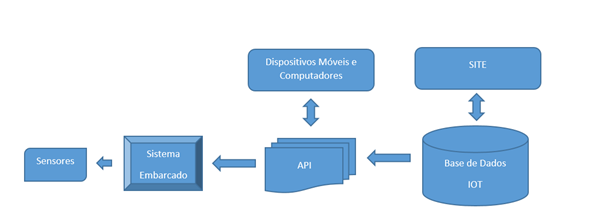
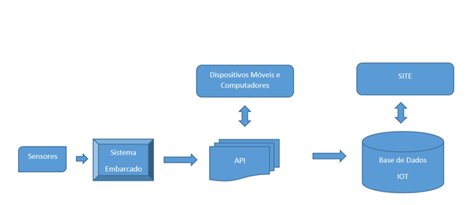
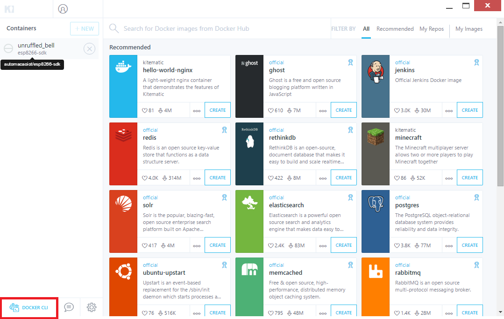
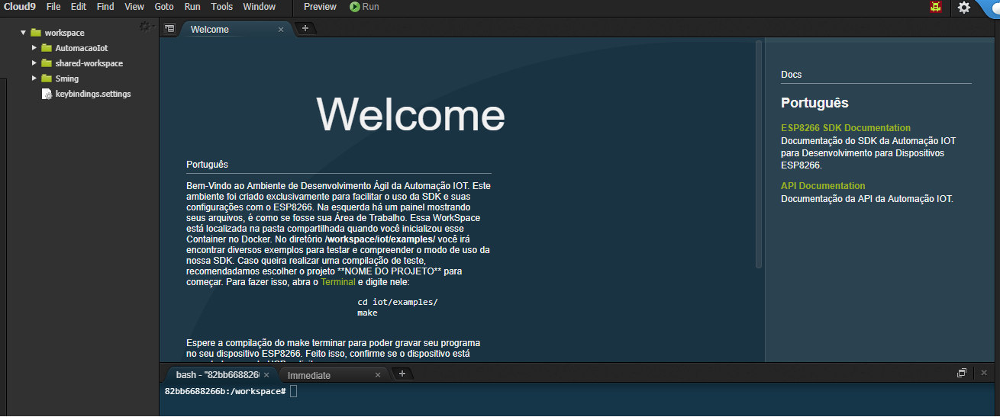

API Automação-IOT
-----------------

A Automaççao-IOT utiliza um conjunto de rotinas padronizadas de programação denominado de API_ que serve de acesso para a  plataforma IOT baseado na WEB.
Através da API que estabelecemos comunicação de entrada e/ou saída com os Dispositivos e/ou Recursos.

**Fluxo de entrada**

**Fluxo de saída**

Informação
~~~~~~~~~~

Será solicitado informação do Dispositivo ou Recurso.

Dispositivo
++++++++++++

Recurso
+++++++

Presença
~~~~~~~~

Atualiza o tempo de vida do Dispositivo ou Recurso

Dispositivo
++++++++++++

Recurso
+++++++

Atualização
~~~~~~~~~~~~

Atualiza dados do Dispositivo ou Recurso

Dispositivo
++++++++++++

Recurso
+++++++

Após termos instalado o Docker_, iremos seguir os procedimentos descritos abaixo, para iniciarmos nosso primeiro projeto IOT. 

.. _Docker: https://esp8266-docker-docs.readthedocs.io/en/latest/index.html

.. image:: ../imagem/docker.jpg
    :align: center

.. _Kinematic:

Kinematic
~~~~~~~~~

Execute o Kinematic. 

Na área de container deverá conter um container denominado **esp8266-sdk**. 

Antes de executar o container, deveremos conectar o nosso ESP8266 a porta USB do computador.

.. _Cloud9:

Cloud9
~~~~~~

Para iniciarmos o Cloud9, devremos clicar em **Web preview**

.. image:: ../imagem/cloud9.png
    :align: center

.. _Web Preview:

Web Preview
~~~~~~~~~~~~

Em seguida será aberto o Browser com o Container do Esp8266-SDK da Automação-IOT.

