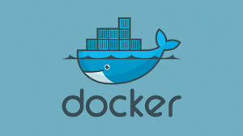
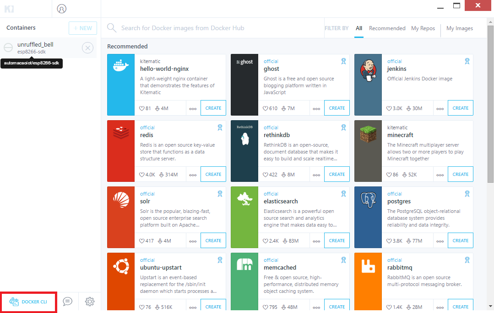
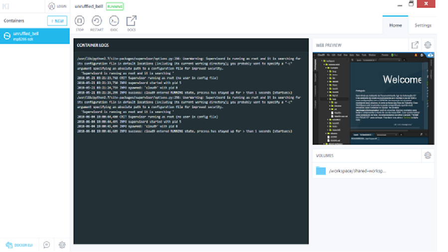
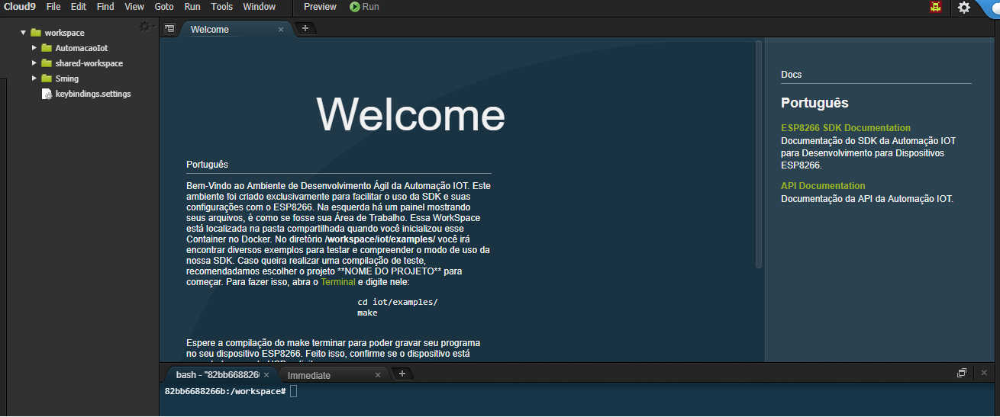

Container
---------

.. _Virtual Docker:

Virtual Docker
~~~~~~~~~~~~~~

Após termos instalado o Docker_, iremos seguir os procedimentos descritos abaixo, para iniciarmos nosso primeiro projeto IOT. 

.. _Docker: https://esp8266-docker-docs.readthedocs.io/en/latest/index.html

.. _Kinematic:

Kinematic
~~~~~~~~~

Execute o Kinematic. 

Na área de container deverá conter um container denominado **esp8266-sdk**. 

Antes de executar o container, deveremos conectar o nosso ESP8266 a porta USB do computador.

.. _Cloud9:

Cloud9
~~~~~~

Para iniciarmos o Cloud9, devremos clicar em **Web preview**

.. _Web Preview:

Web Preview
~~~~~~~~~~~~

Em seguida será aberto o Browser com o Container do Esp8266-SDK da Automação-IOT.

