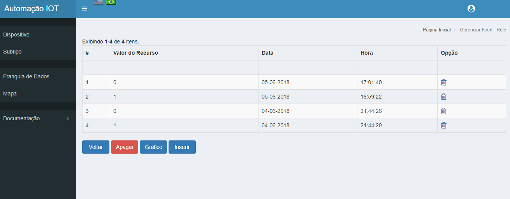
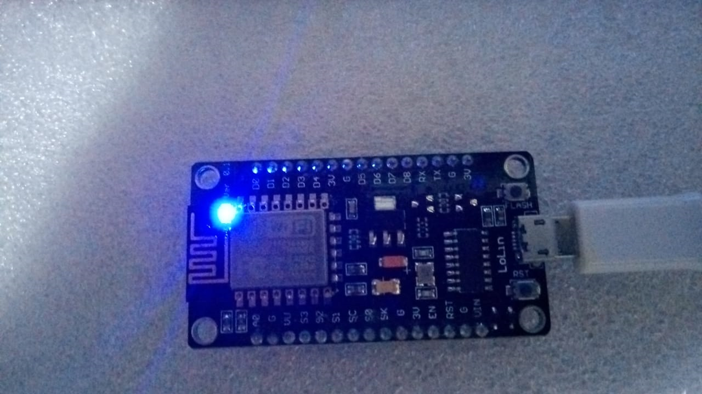
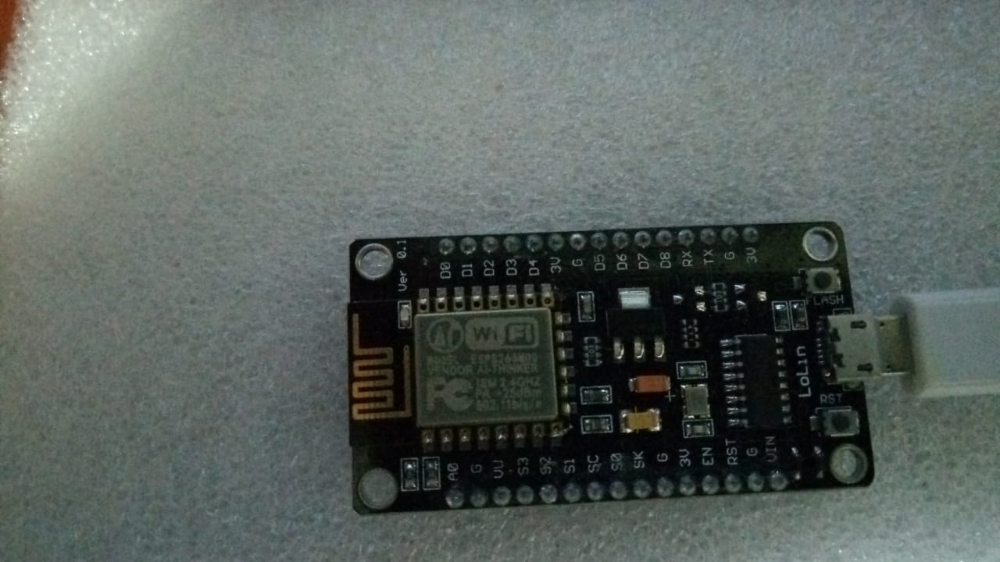

SDK ESP8266
-----------

.. _Comandos Básicos:

Comandos Básicos
~~~~~~~~~~~~~~~~

Antes de iniciarmos a gravação do SDK no ESP8266, deveremos ter conhecimento de alguns comandos.

.. note:: Comandos

   - **makeflashinit**: Formata a Flash Eprom do ESP8266.
   - **make**: Compila o código fonte do SDK ESP8266.
   - **make flash**: Compila o código fonte do SDK ESP8266 e grava o resultado na Flash Eprom do ESP8266.
   - **SERIAL**: Abre o terminal TTY com o ESP8266.

Outros comandos deverão ser pesquisados no site do SMING_.

.. _SMING: https://github.com/SmingHub/Sming

.. _Editando arquivo:

Editando arquivo
~~~~~~~~~~~~~~~~

Iremos gravar o exemplo de SDK denominado **Rele**, para isso deveremos editar o arquivo **application.cpp**.

.. image:: ../imagem/exemploSDKrele.png
    :align: center

Deverão ser copiados do site as chaves Pública e Secreta do Dispositivo, através do ícone do Dashboard  **Chave**:

.. image:: ../imagem/chavesDispositivo.png
    :align: center

Deverão ser modificados as seguintes linhas de código:

.. code-block:: C

    device=new Device(**chave pública**, **chave secreta**);

Deverá ser copiado do site **Dashboard Recurso** o **id do Recurso**.

.. code-block:: C

    rele= new Rele(**id do recurso**,GPIO2,RELE_CLOSED);

Para maiores informações consulte a documentação do SDK_ ESP8266.

.. _SDK: https://esp8266-sdk-docs.readthedocs.io/pt_BR/latest/

.. _Compilando e Gravando:

Compilando e Gravando
~~~~~~~~~~~~~~~~~~~~~

Deveremos abrir um terminal, no SDK **Rele**.

Com o terminal aberto, deveremos executar os seguintes comandos:

- makeflashinit
- make flash

Após o término o ESP8266 irá executar o SDK **Rele** e no site poderemos ver o mesmo em execução.

.. image:: ../imagem/dashboardDeviceON.png
    :align: center

.. _Testando o Recurso

Testando o Recurso
~~~~~~~~~~~~~~~~~~

Para testarmos o funcionamento do site com o ESP8266, deveremos ir para o Dashboard do Recurso e acessar a opção **Gerenciar Feed**

Selecionar o botão **Inserir**

.. image:: ../imagem/inserirFEED.png
    :align: center

Ao selecionarmos **Ativar** e Gravar, iremos observar o Led do ESP8266 acender

Ao selecionarmos **Desativar** e Gravar, iremos observar o Led do ESP8266 apagar

