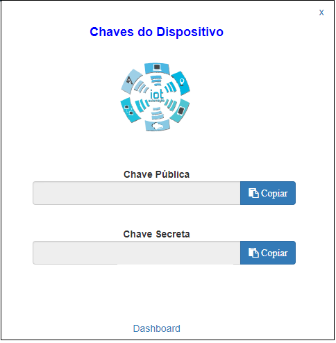

Projeto Rele
------------

.. _Pré-requisitos:

Pré-requisitos
~~~~~~~~~~~~~~

Para iniciarmos a execução do nosso projeto Rele IoT, deveremos:

a) Dowload Firmware ESP8266_;
b) Dowload Nodemcu_ Flash;
c) Dowload WebRepl_ Client; 
d) Dowload SDK_ ESP8266/32; 
e) Dowload Putty_ ; e
f) Dowload Zip ESP-SDK-MicroPython_.

.. _ESP8266: https://github.com/automacaoiot/firmware/esp8266
.. _ESP-SDK-MicroPython: https://github.com/automacaoiot/ESP-SDK-MICROPYTHON

.. _Gravando Firmware:

Gravando Firmware
~~~~~~~~~~~~~~~~~

Antes de iniciarmos o projeto deveremos gravar o firmware específico, no nosso caso o ESP8266.
Para isso deveremos baixar o programa de gravação de firmware o Nodemcu_ Flash.

.. _Nodemcu: https://github.com/nodemcu/nodemcu-flasher

.. _Nodemcu Flash:

Nodemcu Flash
~~~~~~~~~~~~~

Para iniciarmos a gravação do firmware no ESP8266, deveremos configurar o Nodemcu, para isso, selecione a aba
Config, e configure o mesmo com a seleção do arquivo do firmware.

Deverá ser iniciado a gravação do firmware, conecte o ESP8266 na USB do computador (use o cabo microUSB x USB), selecione a porta de uso 
em COM Port e inicie a gravação em Flash(F).

.. _WebRepl Client:

WebRepl Client
~~~~~~~~~~~~~~

WebRepl_ é o cliente  para a comunicação e envio/recebimento de arquivos sob WebSockets, com o MicroPython. 
Deveremos clonar o git para uso posteriore.

.. _Webrepl: https://github.com/micropython/webrepl

.. image:: ../imagem/webrepl.png
    :align: center

.. _Cliente Putty:

Cliente Putty
~~~~~~~~~~~~~

O PuTTY_ é um cliente SSH e telnet, desenvolvido  para a plataforma Windows.

.. _Putty: https://www.putty.org/

.. _Site:

Site
~~~~

Siga os passos do tópico Cadastro.

.. _Criando arquivo main.py:

Criando arquivo main.py
~~~~~~~~~~~~~~~~~~~~~~~

Deveremos criar o arquivo **main.py**, conforme descrito abaixo:

.. code-block:: C

    from Device import Device
    from Rele import Rele

    device = Device("Public Key","Secret Key")
    device.SYS_CPU_160MHZ()
    device.setNetworkConfig('SSID','PWD')

    rele1 = Rele(id do Recurso,device.GPIO02,Rele.OPEN,1000)
    device.start()

Deverão ser copiados do site as chaves Pública e Secreta do Dispositivo, através do ícone do Dashboard  **Chave**:

Deverá ser modificado a seguinte linha de código:

.. code-block:: C

    device = Device("Public Key","Secret Key")

Deverá ser copiado do site **Dashboard Recurso** o **id do Recurso**. No meu caso **id do Recurso** = 1

.. code-block:: C

    rele1 = Rele(1,device.GPIO02,Rele.OPEN,1000)

Para maiores informações consulte a documentação do SDK_ ESP8266.

.. _SDK: https://esp8266-sdk-docs.readthedocs.io/pt_BR/latest/

.. _Configurando o ESP8266:

Configurando o ESP8266
~~~~~~~~~~~~~~~~~~~~~~

Para acessarmos o ESP através do WebSocket, deveremos utilizar o Putty_ através da comunicação serial (USB),
assim que obtivermos o prompt deveremos executar os seguintes comandos abaixo:

.. code-block:: C

    import webrepl_setup

Deveremos informar a senha a ser utlizada e em seguida confirmar o reset do ESP.

.. code-block:: C

    import network;
    wlan = network.WLAN(network.STA_IF);
    wlan.active(True);
    wlan.connect('SSID', 'PWD');

SSID deverá ser substituído pelo nome da rede WIFI

PWD  deverá ser substituído pela senha da rede WIFI

Para verificarmos que o ESP8266 está conectado a rede WIFI, digite o seguinte comando:

.. code-block:: C

    wlan.ifconfig()

.. _Enviando arquivos:

Enviando arquivos
~~~~~~~~~~~~~~~~~

Após criarmos o arquivo main.py, deveremos enviá-lo para o ESP8266 bem como o arquivo Rele.py (ESP-SDK-MicroPython_), 
através do WebRepl_ Client.

Configurar com o IP do ESP8266 que foi informado no tópico _Configurando o ESP8266, informe a senha solicitada
que foi cadastrado (import webrepl_setup), em seguida devremos enviar os arquivos: main.py e Rele.py.

.. _Conectando o Rele ao ESP8266:

Conectando o Rele ao ESP8266
~~~~~~~~~~~~~~~~~~~~~~~~~~~~ 

Deveremos conectar:

.. code-block:: JSON

    IN do rele a GPIO02 do ESP8266.
    VCC do rele ao VCC do ESP8266
    GND do rele ao GND do ESP8266

.. image:: ../imagem/rele.png
    :align: center

.. _Testando o Device e o Recurso:

Testando o Device e o Recurso
~~~~~~~~~~~~~~~~~~~~~~~~~~~~~~

Após concluído as etapas listadas acima, deveremos resetar o ESP8266 e verificar no site o seu correto funcionamento.

Modificando o Feed do recurso:

.. image:: ../imagem/dashboardFeed.png
    :align: center

Selecionar o botão **Inserir**

Ao selecionarmos **Ativar** e Gravar, iremos observar o Led do ESP8266 acender, bem como será realizado o acionamento do Rele.

.. image:: ../imagem/ESP8266LedON.png
    :align: center

Ao selecionarmos **Desativar** e Gravar, iremos observar o Led do ESP8266 apagar, Rele será desativado.

.. image:: ../imagem/ESP8266LedOFF.png
    :align: center
