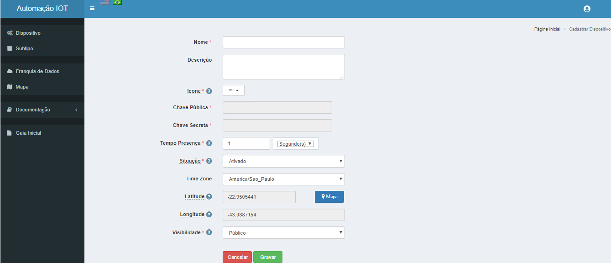
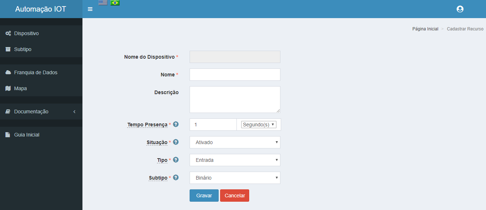

Cadastro
--------

.. _Dispositivo:

Dispositivo
~~~~~~~~~~~

Após termos criado a conta e realizado o login no site da Automação-IOT_ , veremos a Dashboard de Dispositivos.

.. _Automação-IOT: https://automacao-iot.com.br

Deveremos criar nosso primeiro Dispositivo, opção **Cadastrar**, que será a princípio o ESP8266.

Acesse a documentação do Site_ Automação-IOT, para obter maiores informações.

.. _Site: https://site-docs.readthedocs.io/pt_BR/latest/

.. _Recurso:

Recurso
~~~~~~~

Após criarmos nosso Dispositivo, veremos a Dashboard de Dispositivos, com o nosso Dispositivo criado:

Deveremos clicar no ícone de **Opções** denominado **Gerenciar Recursos**. Veremos a Dashboard de Recursos:

Deveremos criar o recurso **Rele**, opção cadastrar:

Após criarmos nosso Recurso, veremos a Dashboard de Recursos, com o Recurso **Rele** criado:

